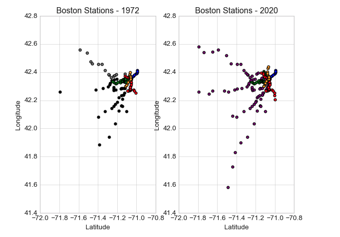

## Pandas-EDA-Case-Study - Explore Transit Lines in Boston

### Overview of project
The data utilized for this case study are from a publicly available dataset of Transit Systems of World, accessed at Kaggle.com on July 3, 2020.

The data was produced in the collaborative mapping platform citylines.co and includes transportation line data from a number of cities from around the world including London, Berlin, Mexico City, Barcelona, Washington D.C., and others covering many thousands of kilometers of lines.

This dataset includes 7 files detailing cities, systems, lines, section lines, stations, station lines, and transport modes. This historical and international dataset documents how transit lines have evolved all over the world. Besides time, number of lines, and line length, the dataset contains spatial locations that could be mapped using a geospatial library in Python like GeoPandas or Folium.

After a review of the dataset and assessment of missing data, our team decided to focus on a particular city to further examine how the transit system has changed over time. The EDA of the team focused on the question of the impact of the oil price on the development of the transit system in Boston, Mass.

#### Data exploration and Pre-Processing

#### EDA - How did the development of the Boston transit system change over time? 
The number of transit stations between 1972 and 2020 increased significantly. The lines expanded, and the number of stations further away from the city increased.

